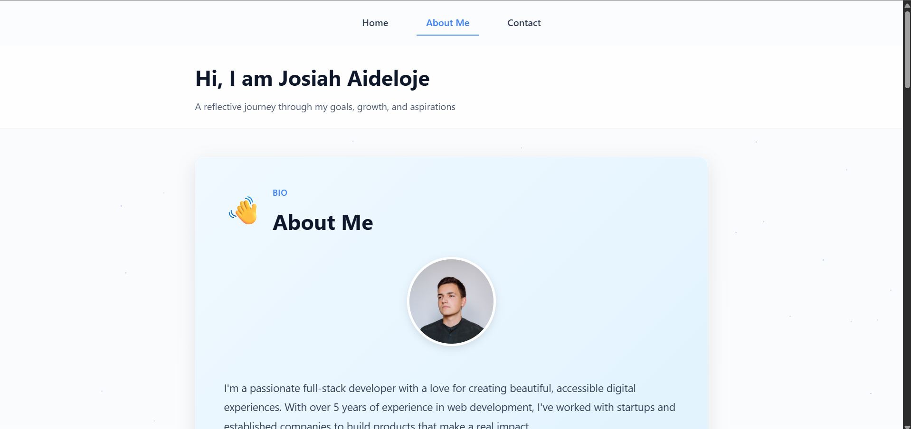

# 🌟 Frontend Wizards Stage 0 — Profile Card

<p align="center">
  
  
  
</p>

A simple, accessible, and visually appealing **Profile Card** built using **HTML**, **CSS**, and **JavaScript**.  
This project showcases fundamental frontend development skills such as responsive design, semantic HTML, and interactivity.

---

## 🚀 Live Demo

🔗 **Live Preview:** [https://eragbai2001.github.io/Profile/](https://eragbai2001.github.io/Profile/)  
📦 **GitHub Repository:** [https://github.com/Eragbai2001/Profile](https://github.com/Eragbai2001/Profile)

---

## 🧩 Features

### Stage 0 - Profile Card
✅ Clean and minimal design  
✅ Responsive layout for all screen sizes  
✅ Hover effects and subtle animations  
✅ Semantic HTML structure  
✅ JavaScript interactivity with real-time timestamp display  
✅ Fully accessible with proper ARIA labels

### Stage 1 - Multi-Page Application
✅ **Contact Us Page** with form validation  
  - All required fields with proper validation
  - Email format validation
  - Message length validation (minimum 10 characters)
  - Success and error messages with proper ARIA associations
  - Full keyboard accessibility
  
✅ **About Me Page** with reflective content  
  - Bio section with profile image
  - Program goals
  - Areas of low confidence
  - Note to future self
  - Extra thoughts and reflections
  - Smooth scroll animations and interactive UI

✅ **Accessibility**
  - All form inputs have associated labels
  - Error messages linked with `aria-describedby`
  - Keyboard navigable throughout
  - Proper semantic HTML structure

✅ **Testing Ready**
  - All required `data-testid` attributes implemented
  - Contact form: `test-contact-name`, `test-contact-email`, `test-contact-subject`, `test-contact-message`, `test-contact-submit`
  - Error messages: `test-contact-error-<field>`
  - Success message: `test-contact-success`
  - About page: `test-about-page`, `test-about-bio`, `test-about-goals`, `test-about-confidence`, `test-about-future-note`, `test-about-extra`

---

## 📸 Screenshot



---

## 📂 Project Structure

```
Profile/
│
├── index.html          # Main profile card page (Stage 0)
├── about.html          # About Me page with reflective content (Stage 1)
├── contact.html        # Contact Us page with form validation (Stage 1)
├── styles.css          # CSS for styling the profile card
├── script.js           # JavaScript for interactivity
├── screenshot.png      # Screenshot of the profile card
├── README.md           # Documentation file
└── test.md             # Notes or testing information
```

---

## 🧠 How to Run Locally

# 1. Clone this repository
git clone https://github.com/Eragbai2001/Profile.git

# 2. Navigate into the project folder
cd Profile

# 3. Open index.html in your browser


